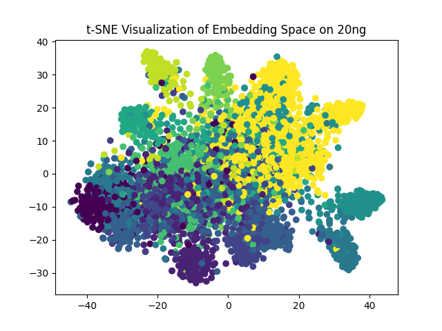

# Document-Embedding-Extractor (Updating)

# Prerequisites
* Python 3.6 or above
* sklearn
* swifter
* nltk
* tqdm
* numpy
* pandas
* Pytorch 1.10 or above **with GPU support**
* transformers
* sentence-transformers
* pytorch_metric_learning

# Project Structure
```
├── run.py            # the main program + extract document matrixs from original text
├── model.py          # model definition
├── trainer.py        # optimize the model by predefined loss
├── evaluate.py       # compute Recall@K and visualize the embedding space
└── utils.py          # data processing and other utilities
```

# Usage
## Using default arguments
```shell
python run.py 
```
## Using self-defined arguments
```shell
python run.py --backbone nli-bert-base --pooling_ops max --batch_size 32 --margin 0.05 --is_debug False --device 0
```

# Result
## Logs
After successful training, you can see logs like below:
```
INFO:root:Training on 20ng
INFO:root:Eval on 20 News Group
INFO:root:Ave number of sentences:11.2959
INFO:sentence_transformers.SentenceTransformer:Load pretrained SentenceTransformer: nli-bert-base
INFO:sentence_transformers.SentenceTransformer:Use pytorch device: cuda
INFO:root:20ng map to embeddings with 256 dim
INFO:root:Fold0::Recall@1:0.4701 Recall@2:0.5495 Recall@4:0.6079 Recall@8:0.6809 Recall@16:0.7418
INFO:root:Fold1::Recall@1:0.4845 Recall@2:0.5409 Recall@4:0.6015 Recall@8:0.6792 Recall@16:0.7619
INFO:root:Fold2::Recall@1:0.5011 Recall@2:0.5529 Recall@4:0.6061 Recall@8:0.6683 Recall@16:0.7439
INFO:root:Fold3::Recall@1:0.5115 Recall@2:0.5717 Recall@4:0.6331 Recall@8:0.6967 Recall@16:0.7646
INFO:root:Fold4::Recall@1:0.4785 Recall@2:0.5428 Recall@4:0.6028 Recall@8:0.6735 Recall@16:0.7471
INFO:root:Overall::Recall@1:0.4891 Recall@2:0.5516 Recall@4:0.6103 Recall@8:0.6797 Recall@16:0.7518
```
## Visualization
If the model converges smoothly, you can see the embeddings are well clustered according to their classes. The visualization will be generated during the evaluation.



# Reference
- [Convolutional Neural Networks for Sentence Classification](https://arxiv.org/pdf/1408.5882.pdf)
- [Sentence-BERT: Sentence Embeddings using Siamese BERT-Networks](https://arxiv.org/abs/1908.10084)
- [Multi-Similarity Loss with General Pair Weighting for Deep Metric Learning](https://arxiv.org/abs/1904.06627)
